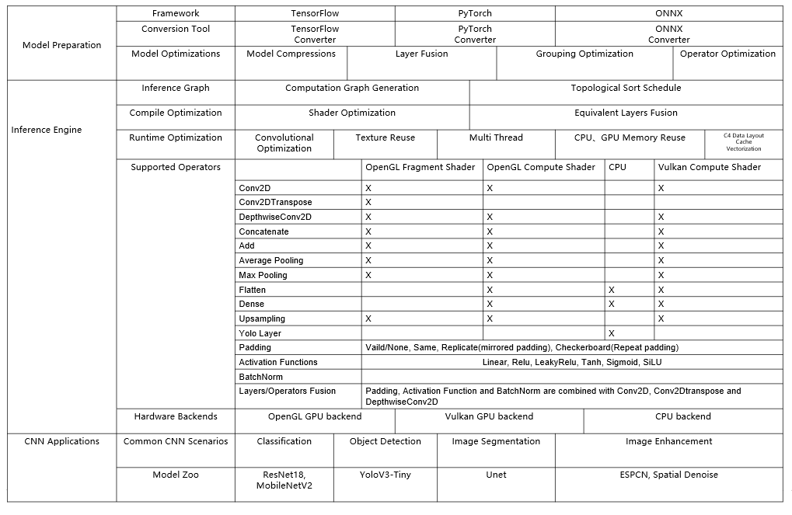

## What is ShaderNN?
 ShaderNN is a lightweight deep learning inference framework optimized for Convolutional Neural Networks. It provides high-performance inference for deep learning applications in image and graphics process on mobile devices.
 

## Why use ShaderNN?
- High Performance
  - Makes full use of the parallel computing advantages of GPU Shader to implement core operators, directly operate the texture data of graphics graphics and image applications, save I/O time, and integrate with the graphics rendering pipeline to maximize the use of computing resources;
  - Pre-building the static computation graph for inference first and then running it, compared to the dynamic graph, the graph structure can be optimized before running, such as constant folding, operator fusion, etc., which can obtain faster forward operation speed;
  - When the model is running, the running backend will be selected statically or dynamically according to the platform resources, and the running parameters of the kernel will be dynamically adjusted to achieve the best energy consumption utilization at runtime
  - Optimizes for Convolutional Neural Networks to improve real-time performance;
  - Supports heterogeneous device hybrid computing, and currently supports CPU and GPU;
  - Provides a demo app pipeline optimized for throughput over latency, minimized data transfer and optimized for video processing
- Versatility
  - Supports popular framework formats such as TensorFlow/PyTorch/ONNX
  - Supports popular Convolutional Neural Networks (CNN), such image classification, object detection, image segmentation, image enhancement;
  - Supports user-defined operators, convenient to implement new operators and models;
- Portability & extensibility
  - OpenGL-based does not require reliance on other third-party technology libraries, making it easy to port, deploy and upgrade
  - Simple input/output interface, compatible with GPU processing

## Architecture:

## Getting Started:
  - Pleaes refer to [Getting-Started.md](docs/Getting-Started.md) for details.

## Model Conversion:
  - Support conversion from TensorFlow , PyTorch and ONNX based models. Please refer to [ModelConversion.md](tools/convertTool/ModelConversion.md) for details.

## Model Zoo/Examples:
  - Provide image classification, object detection, image segmentation and image enchancement models for reference. Please refer to [ModelZoo.md](modelzoo/ModelZoo.md) for details.

## Operators:
  - Implement basic CNN operators by using fragment shader, computer shader or CPU. For a complete list of operators being supported, please refer to [Operators.md](docs/Operators.md) for details.

## Benchmark:
  - Benchmark models based in Model Zoo against TFLite framework. Please refer to [Benchmark.md](benchmark/Benchmark.md) for details.

## Branching Policy:
- For dev branches for your own use, please prefix it with "your_name/". For example, "bruce.lee/training_session_1"

## License:
- Apache License 2.0

## Acknowledgement:
ShaderNN makes use of the following third party libraries:
- [ncnn](https://github.com/Tencent/ncnn)
- [MNN](https://github.com/alibaba/MNN)
- [opencv](https://github.com/opencv/opencv)
- [libyuv](https://chromium.googlesource.com/libyuv/libyuv)
- [libjpeg](https://github.com/libjpeg-turbo/libjpeg-turbo)
- [cli11](https://github.com/CLIUtils/CLI11)
- [cmrc](https://github.com/vector-of-bool/cmrc)
- [eigen](https://gitlab.com/libeigen/eigen)
- [glad](https://github.com/Dav1dde/glad)
- [glfw](https://github.com/glfw/glfw)
- [glm](https://github.com/g-truc/glm)
- [picojson](https://github.com/kazuho/picojson)
- [stb_image](https://github.com/nothings/stb)
- [readerwriterqueue](https://github.com/cameron314/readerwriterqueue/)

ShaderNN makes use of models trained and converted from Tensorflow, PyTorch and ONNX, and uses Netron visualizer:
- [Tensorflow](https://github.com/tensorflow/tensorflow)
- [PyTorch](https://github.com/pytorch/pytorch)
- [ONNX](https://github.com/onnx/onnx)
- [Netron](https://github.com/lutzroeder/netron)

